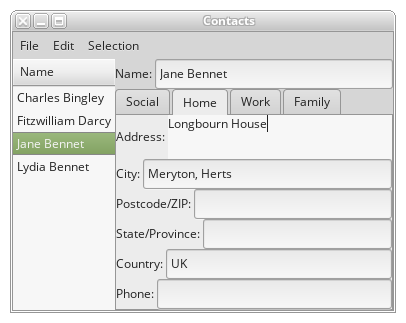

# Contacts

Organise people and organisations. Makes use of dynamic types.



Certain UI-related functions are in a separate module, imported into the script.

## UIStuff.pinafore
```pinafore
{!examples/UIStuff.pinafore!}
```

## contacts
```pinafore
{!examples/contacts!}
```
