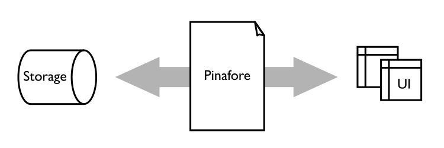

```{toctree}
:hidden:
Home<self>
getting-started
invocation
module-documentation
future-plans
building
```
```{toctree}
:hidden:
:caption: Language
syntax
expressions
declarations
implicit-parameters
record-functions
type-system
types
dynamic-supertypes
do-notation
applicative-notation
modules
```
```{toctree}
:hidden:
:caption: Library
library/pinafore
library/media
library/gnome
library/UILib
```
```{toctree}
:hidden:
:caption: Examples
examples/stopwatch
examples/calendar
examples/contacts
examples/events
examples/quine
```
# Pinafore {{PINAFOREVERSION}}

*(For an overview of what makes Pinafore unique, see [Sixteen Unusual Things About Pinafore](https://semantic.org/post/sixteen-unusual-things-about-pinafore/).)*

Pinafore is a language that allows you to structure and store information, and create user interfaces for it.



The language is loosely based on Haskell, featuring:

* type-checking and inference, with optional type signatures,
* pattern-matching,
* lazy evaluation,
* separation of pure functions from executable actions.

Pinafore is an interpreted language; programs are first checked (parsed and type-checked), and then executed.

Pinafore is available as a 64-bit Debian package for Ubuntu 22.04, Debian 12, and later, and as a Nix flake.
There is also a syntax-highlighting language extension for Visual Studio Code.

## Type System

Pinafore implements Stephen Dolan's Algebraic Subtyping, an extension of Hindley-Milner to allow subtyping.
Subtyping relationships (`P <: Q`, or "every P is a Q") are part of how people tend to naturally organise information,
making the representation of information in the type system more natural.
Hindley-Milner is the type system that languages such as ML and Haskell are based on, though extended in different ways.

## Storage

Pinafore stores relationships between typed entities, known as properties, in a database on your computer.
These properties are composable, and can be used to retrieve and update information.

For example, one can compose properties "mother" and "name" into a property "mother's name".
Then one can use that property to look up or update the mother's name of a given person,
or alternatively, retrieve the set of people whose mother's name is a given name.

## User Interface

Pinafore allows the composition of typed "models" of information, which can be attached to appropriate user interface elements.
Models can be read and modified either in code or by the attached user interfaces.
Models are also "live" in that they automatically propagate updates to user interfaces.
Information is retrieved from storage in the form of these live models.

For example, one can easily create a user interface element listing everyone whose mother's name is "Jane".
Whenever this set of people changes, the user interface will automatically update to reflect it.
